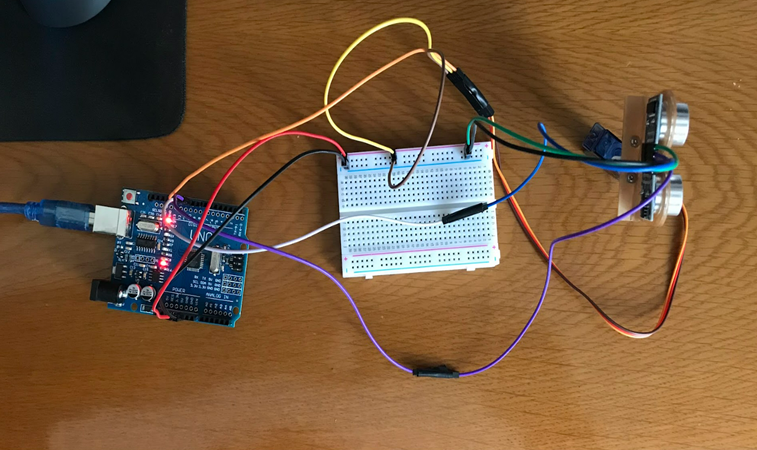
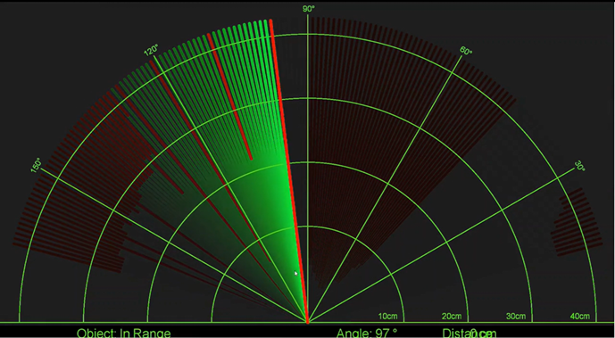

#  Arduino ile Sonar Projesi
  Arduino ve Proccessing ile yaptığım bir çalışma. Kullandığım malzemeler aşağıdadır.
  
  + 1 Adet Arduino Uno
  + 1 adet HC-SR04 Ultrasonik Mesafe Sensörü
  + 1 adet 180º dönebilen SG90 RC Mini (9gr) Servo Motor
  + 1 adet Orta Boy Breadboard
  + Jumper Dupont Kablo (Erkek-Erkek ve Erkek-Dişi)
  + 1 adet HC-SR04 Ultrasonik Mesafe Sensörü Tutucu Aparat
   

# Projeden Görüntüler

   

   

